# Praktyczna Mechanika Kwantowa 
dr Remigiusz Durka, 2026

## Lista 1

1. Ustal ręcznie ze stacjonarnego równania Schrödingera **funkcję falową** (łącznie z jej unormowaniem) a także wzór na energię cząstki wewnątrz studni nieskończonego potencjału:

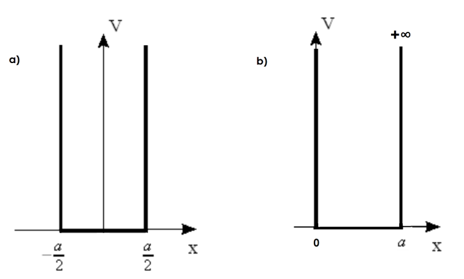

   
      Zwróć uwagę na kwestie parzystości rozwiązań i kolejnych wzbudzeń oraz unormowania.

2. Wygeneruj dla poprzedniego zadania, przy $a = 8$ nm:
   
- a. **Pojedynczy wykres** energii w eV w zależności od stanu wzbudzenia dla pięciu pierwszych stanów wzbudzenia elektronu.
   
- b. Pokaż na **jednym wykresie** przebieg funkcji falowej dla pięciu pierwszych stanów wzbudzenia elektronu.
   
- c. Wygeneruj 5 **osobnych wykresów** modułu funkcji falowej dla pięciu pierwszych stanów wzbudzenia elektronu.
   
      Znajdź samodzielnie dane jak masa elektronu, stała Plancka i konwersję [Joule] $\rightarrow$ [eV].

3. Zbadaj zależność **czterech** pierwszych **poziomów energetycznych** od szerokości studni $w$ dla elektronu w nieskończonej studni potencjału zbudowanej z arsenku galu – GaAs powodującego modyfikację masy $m^* = 0.067m$, gdzie $m$ to masa elektronu. Rozważyć szerokości studni z zakresu $1$ nm $< w <$ $30$ nm. Wyniki przedstaw na jednym wykresie.

4. Mając daną **skończoną studnię kwantową** szerokości $10$ nm, znajdź numerycznie wszystkie poziomy energetyczne dla głębokości potencjału kolejno $V_0 = 0.5$ eV, $1$ eV i $2$ eV. Przyjąć masę elektronu w studni $m_w^* = 0.067m$ oraz wewnątrz bariery $m_b^* = 0.10m$. Numeryczne rozwiązanie może być wdrożone w startowym równaniu Schrödingera (`NDSolve`) lub tylko w jego dalszej części przy równaniach na tangens i cotangens.

## Lista 2

1. Oblicz **ręcznie** współczynnik transmisji $T$ przez **pojedynczą** barierę energetyczną dla następujących danych $m_w = 0.067m_e$, $m_b = 0.10m_e$, $V_0 = 0.334$ eV, gdzie $m_e$ to masa elektronu. Zbadaj na komputerze $T(E)$ (z energią w [eV]) dla kilku szerokości bariery $w$, z przedziału $2$ nm $< w < 10$ nm. Wyniki obliczeń przedstaw na wykresie.

2. Zastosuj **metodę macierzy przejścia** do uzyskania postaci współczynnika transmisji $T$ przez **pojedynczą** barierę z poprzedniego zdania.

3. Zastosuj metodę macierzy przejścia do podania wzoru na współczynnik transmisji $T$ przez **podwójną** barierę dla elektronu przy następujących danych $m_w = 0.067m_e$, $m_b = 0.10m_e$, skoku potencjału $V_0 = 0.334$ eV, szerokości barier $b$ oraz przerwy między nimi oznaczonej jako $w$. Rozważ tylko energie mniejsze od bariery potencjału!

4. Przyjmując jednakową szerokość barier $b = 10$ nm, zbadać $T(E)$ dla kilku odległości $w$ między barierami: $2$ nm, $5$ nm, $8$ nm, $10$ nm. Wyniki obliczeń przedstaw na jednym wykresie.

5. Przyjmując $A = 1$, zbadaj przebieg funkcji falowej $(Re[\psi], Im[\psi],  |\psi|^2)$ dla warunku $T(E) = 1$, czyli przyjmując którąś z rezonansowych energii barier $E < V_0$ (z dokładnością do czterech lub pięciu miejsc po przecinku) dla jakieś ustalonej konfiguracji barier.

#### Wskazówka 1:
- Przy uproszczeniach Mathematica ma problemy ze sprzężeniami zespolonymi oraz policzeniem $Abs[z]^2$. Rozwiązaniem problemu jest:

  ```mathematica
  z = 2 + I;
  z*(z /. {Complex[re_, im_] :> Complex[re, -im]})
  ```

#### Wskazówka 2:
- Pamiętaj by rozdzielić zagadnienie (poprzez polecenie Assumptions) na dwa rozdzielne scenariusze: energia mniejsza od $V_0$, czyli $(V_0 - E) > 0$ i rzeczywiste kappa, energia większa od $V_0$, czyli $V_0 - E < 0$, który generuje jednostkę urojoną z pierwiastka z ujemnej liczby.

## Lista 3

1. Korzystając w Mathematice z polecenia `SetPrecision` oraz Metody Newtona-Raphsona:
   
   ```mathematica
   NewtonsMethodList[f_, {x_, x0_}, n_] :=  
   NestList[# - Function[x, f][#]/Derivative[1][Function[x, f]][#] &, x0, n]
   ```

policz z dokładnością do 20 miejsca po przecinku rozwiązanie równania $\tan(x) = x$. Porównaj wynik z poleceniem `FindRoot`.

2. Znajdź numerycznie z metody Newtona-Raphsona **energie jako funkcje wektora falowego** $g$ dla supersieci zbudowanej z powtarzających się fragmentów: studnia o szerokości $w$ i bariera o szerokości $b$ i potencjale $V_0$, korzystając z poniższego warunku:

$$
\cos(wk) \cosh(b\nu) - \frac{m_b^2 k^2 - m_w^2 \nu^2}{2 m_b m_w k \nu} \sin(wk) \sinh(b\nu) - \cos(g(w + b)) = 0
$$

gdzie

$$
k = \sqrt{\frac{2 m_w E}{\hbar^2}}, \quad \nu = \sqrt{\frac{2 m_b (V_0 - E)}{\hbar^2}}
$$

Przyjąć też $w = b = 2, 3, 4, 5$ nm.

#### Wskazówka

Zacznij od podania np. 100 punktów g z przedziału (-1,1) w jednostkach $[pi/w]$ i dla nich ustal odpowiadające im wartości energii spełniające podane równanie. Zbierając punkty w pary $(g_i,E_i)$ narysuj wykres, który powinien się przedstawiać następująco (`AspectRatio`, podpisane osie, jakaś legenda, linie pomocnicze):

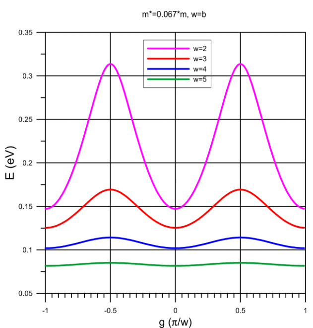

## Lista 4

1. Używając kodu z wykładu znajdź rozwiązania równania Schrödingera dla bariery potencjału o profilu: 
   - a) prostokątno-trójkątnym, 
   - b) trapezowym, 
   - c) parabolicznym $V(x) = 1 - x^2$, 
   - d) kosinusowym $V(x) = \cos(x)$.

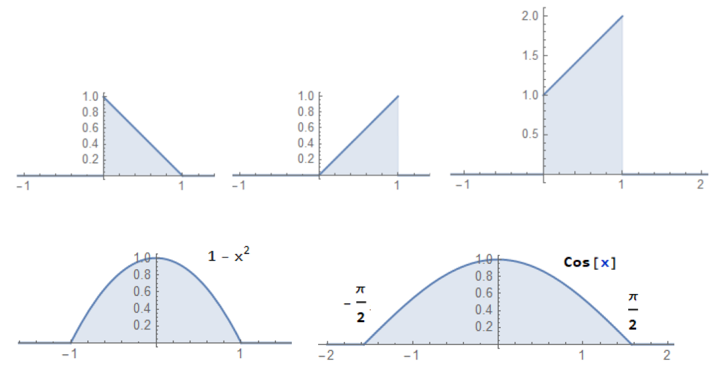
Realizacja obejmuje wyrysowanie profilu potencjału, znalezienie postaci funkcji (ze startową amplitudą $A = \frac{1}{2}$ lub $\frac{1}{4}$), wykonanie zszywania, wykres części rzeczywistej i urojonej $\psi$ oraz osobnej ilustracji $|\psi|^2$. Przyjąć energię startową tak, by trafiała w połowę maksimum potencjału.

2. Rozważ „kwantowy pryzmat” (potencjał równoboczno-trójkątny) i narysuj przebieg $Re[\psi]$, $Im[\psi]$, $|\psi|^2$ dla fali o początkowej energii o wartości $\frac{1}{3}$, $\frac{2}{3}$ i $\frac{1}{2}$ maksymalnej wysokości potencjału (optymalizuj startową amplitudę by wyszedł ładny wykres).
   
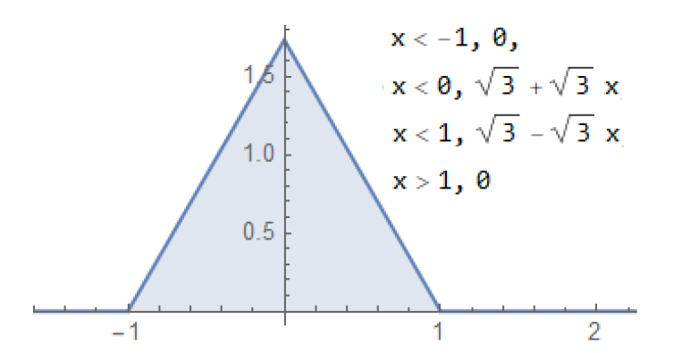

3. Pokaż w Mathematice (lub ręcznie), że działając odpowiednim Hamiltonianem na stany własne kwantowego oscylatora:

$$
\psi_n(x) = \frac{1}{\sqrt{2^n n!}} \cdot e^{-\frac{m\omega x^2}{2\hbar}} \cdot H_n\left(\sqrt{\frac{m\omega}{\hbar}} x\right), \quad n = 0, 1, 2, \ldots
$$

otrzymamy Energię w postaci $E_n = \hbar\omega\left(n + \frac{1}{2}\right)$. Wskazówka: zrób Solve ze względu na energię.

4. Policz ręcznie, korzystając z rekurencyjnych zależności znalezionych np. na Wikipedii, **pięć pierwszych wielomianów**: 
   - Hermite'a, 
   - Chebyshev'a, 
   - Legendre'a, 
   - Laguerre'a. 
   
Potem w Mathematice wywołaj zdefiniowane wewnętrznie wielomiany (Help -> HermiteH, etc.) i odtwórz te piątki wielomianów w każdym przypadku jednolinijkowym kodem. Potem wyrysuj na jednym wykresie pierwszych pięć wielomianów Hermite'a dla $-1 < x < 1$. Potem to samo powtórz dla: pięciu wielomianów Chebyshev'a, 5 wielomianów Legendre'a oraz 5 wielomianów Laguerre'a.

1. W książce Schroedingera z 1928 roku pojawia się wykres funkcji falowych oscylatora. Wygeneruj identyczny wykres wychodząc od rozwiązania oscylatora (zadbaj o legendę, dobry przedział, AspectRatio, itd.).

**Uwaga:** Schroedinger w swoim rozwiązaniu rozważa częstotliwość, lepiej więc wyjdź od wzoru z zadania 3. Masa, częstość kołowa, stała Plancka, all = 1.

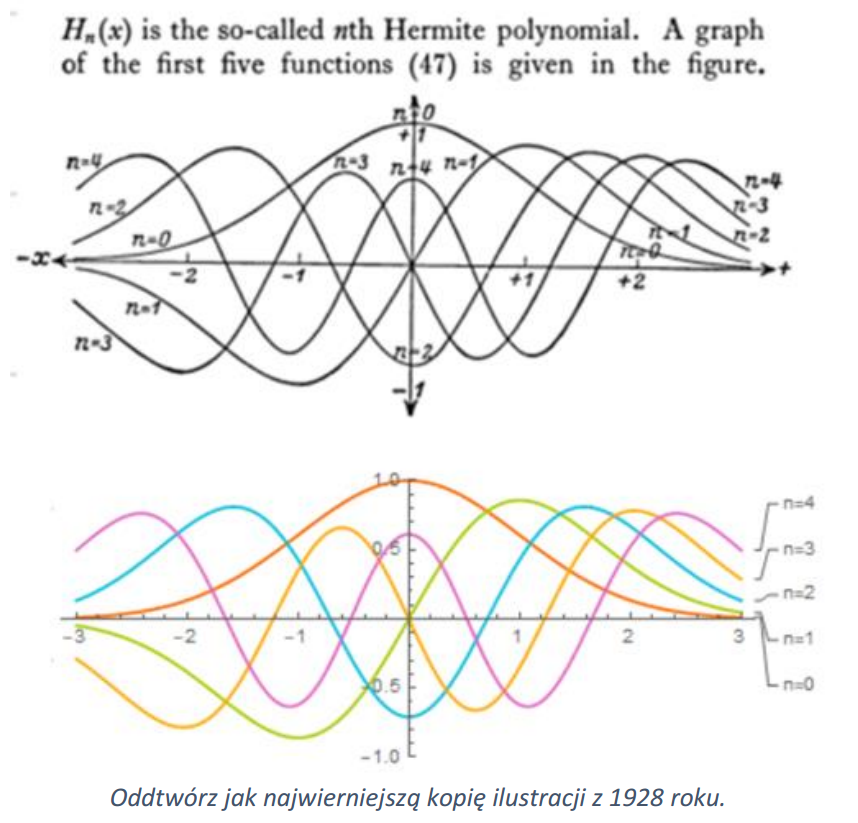

## Lista 5

1. Pokaż w Mathematice, używając wbudowanych `SphericalHarmonicY`, że rzeczywiście:

$$
\vec{L}^2 Y_{lm}(\theta, \phi) = l(l + 1)\hbar^2 Y_{lm}(\theta, \phi)
$$

$$
L_z Y_{lm}(\theta, \phi) = m\hbar Y_{lm}(\theta, \phi)
$$

czyli $l(l + 1)\hbar^2$ jest wartością własną kwadratu momentu pędu $\vec{L}^2$.

2. Sprawdź czy wbudowana funkcja `SphericalHarmonicY` pokrywa się z definicją Schiffa:

$$
Y_{lm}(\theta, \phi) = \epsilon \left[\frac{(2l + 1)(l - |m|)!}{4\pi(l + |m|)!}\right]^{\frac{1}{2}} P_l^m(\cos \theta) e^{im\phi}
$$

gdzie $\epsilon = (-1)^m$ dla $m > 0$ i $\epsilon = 1$ dla $m \leq 0$, zaś $P_l^m[x]$ to wielomiany stowarzyszone Legendre’a zdefiniowane w Mathematice jako `LegendreP[l, m, x]`.

3. Wiedząc, że

$$
\frac{m_e q_e^4}{2(4\pi\epsilon_0)^2\hbar^2} = \frac{m_e q_e^4}{8h^2\epsilon_0^2} = 13.605693122994 \ \text{eV}
$$

narysuj widmo energii atomu wodoru w eV dla pierwszych 10 stanów, z energiami zadanymi wzorem:

$$
E = -\frac{m_e}{2} \left(\frac{q_e^2}{4\pi\epsilon_0\hbar}\right)^2 \frac{1}{n^2}.
$$

4. Ze wzoru na serię Balmera (powrót z wzbudzenia z n-tej orbity na drugą, $E = h \nu, c = \nu\lambda$):

$$
\frac{1}{\lambda} = R_H\left(\frac{1}{2^2} - \frac{1}{n^2}\right), \quad \text{gdzie} \ n = 3, 4, 5, 6, \ldots, \ R_H = 1.09677576 \times 10^7 \ \text{m}^{-1}
$$

policz odpowiadające długości fali (inne serie mają wynikowe fale poza spektrum widzialnym!). Wygeneruj w Mathematice** kolory fal** realizowanych w serii Balmera i porównaj z długościami oraz kolorami podawanymi w literaturze. Zrób obrazek ze **spektrum widma wodoru** (czarne tło, kolorowe linie).

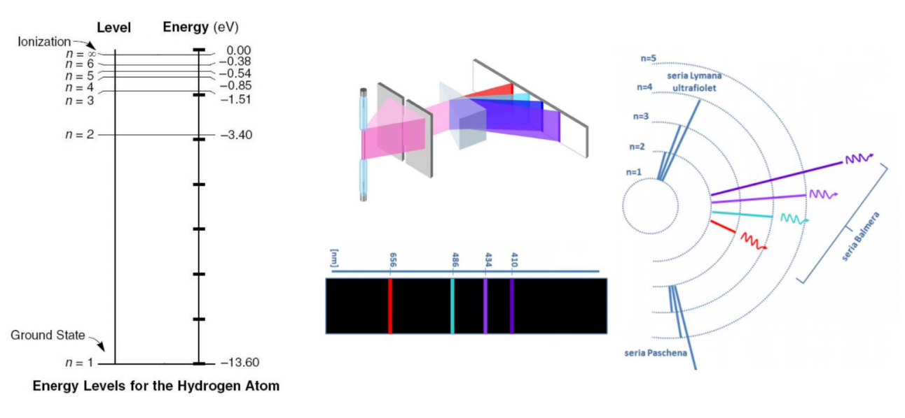

5. Wygeneruj jednym poleceniem wszystkie **etykiety** funkcji $\psi_{n \ell m}$ aż do $n = 10$.

6. Pamiętając, że $l = 0, 1, 2, \ldots, n - 1$, oraz $m = -l, \ldots, -1, 0, 1, \ldots, l$:

   a. Wyprodukuj w Mathematice postać **pierwszych 6 radialnych funkcji** dla atomu wodoru:

$$
R_{nl}(r) = \sqrt{\left(\frac{2}{n a_0^*}\right)^3 \frac{(n - \ell - 1)!}{2n(n + \ell)!}} e^{-\rho/2} \rho^\ell L_{n - \ell - 1}^{2\ell + 1}(\rho)
$$

gdzie $L_{n - \ell - 1}^{2\ell + 1}$ to wielomiany Laguerre’a, zmienna pomocnicza $\rho = \frac{2r}{n a_0^*}$, zaś $a_0^* = 5.29 \times 10^{-11} \ \text{m}$ to promień pierwszej orbity Bohra.

   b. Za pomocą wbudowanej funkcji `SphericalHarmonicY` w Mathematice podaj postać **kątową funkcji falowej** dla atomu wodoru dla wszystkich przypadków do $n = 3$ włącznie. Wskazówka: powinno być ich 9.

   Poglądowo powinniśmy oczekiwać formuł w postaci:
   $R_{10} = 2 \left(\frac{Z}{a_0}\right)^{\frac{3}{2}} e^{-Zr/a_0}$

   $R_{21} = \frac{1}{\sqrt{3}} \left(\frac{Z}{2a_0}\right)^{\frac{3}{2}} \left(\frac{Zr}{a_0}\right) e^{-Zr/2a_0}$

   $R_{20} = 2 \left(\frac{Z}{2a_0}\right)^{\frac{3}{2}} \left(1 - \frac{Zr}{2a_0}\right) e^{-Zr/2a_0}$

   $R_{32} = \frac{2\sqrt{2}}{27\sqrt{5}} \left(\frac{Z}{3a_0}\right)^{\frac{3}{2}} \left(\frac{Zr}{a_0}\right)^2 e^{-Zr/3a_0}$

   $R_{31} = \frac{4\sqrt{2}}{3} \left(\frac{Z}{3a_0}\right)^{\frac{3}{2}} \left(\frac{Zr}{a_0}\right) \left(1 - \frac{Zr}{6a_0}\right) e^{-Zr/3a_0}$

   $R_{30} = 2 \left(\frac{Z}{3a_0}\right)^{\frac{3}{2}} \left(1 - \frac{2Zr}{3a_0} + \frac{2(Zr)^2}{27a_0^2}\right) e^{-Zr/3a_0}$

   $Y_{00} = \frac{1}{\sqrt{4\pi}}$

   $Y_{11} = \sqrt{\frac{3}{8\pi}} \sin \theta \exp(i\phi)$

   $Y_{10} = \sqrt{\frac{3}{4\pi}} \cos \theta$

   $Y_{22} = \sqrt{\frac{15}{32\pi}} \sin^2 \theta \exp(2i\phi)$

7. Wygeneruj **explicite postać wszystkich funkcji falowych atomu wodoru** dla $n = 1, 2, 3$.

$$
\psi_{n\ell m}(r, \theta, \varphi) = \sqrt{\left(\frac{2}{na_0^*}\right)^3 \frac{(n - \ell - 1)!}{2n(n + \ell)!}} e^{-\rho/2} \rho^\ell L_{n - \ell - 1}^{2\ell + 1}(\rho) Y_{\ell m}(\theta, \varphi)
$$

Wyświetlając wyniki spróbuj też wygenerować etykiety $n, \ell, m$ za pomocą `Print`.

8. Narysuj **przekroje orbitali atomowych od n = 1 do n = 4** korzystając z pomocniczego pliku *.nb z `DensityPlot`. Użyj polecenia „//TableForm” do lepszego rozłożenia rozwiązań.

9. Narysuj **3D orbitale atomowe dla n = 2** korzystając z funkcji `DensityPlot3D`. Wybierz potem jakiś jeden przykład z dużym $n$, który wygeneruje jakiś skomplikowany układ.

## Lista 6

1. Z definicji niepewności pomiaru obserwabli $\Delta \hat{A} = \sqrt{\langle \hat{A}^2 \rangle - \langle \hat{A} \rangle^2}$ policz dla elektronu w studni nieskończonego potencjału rozciągającej się od $-a/2$ do $a/2$

$$
\psi(x) = \sqrt{\frac{2}{a}} \sin\left(\frac{n\pi}{a} x + \frac{1}{2} n\pi\right)
$$

   a. niepewność pomiarową położenia $\Delta \hat{x}$.  
   b. niepewność pomiarową x-owej składowej pędu $\Delta \hat{p}$.

2. Sprawdź czy trzy kolejne stany elektronu w studni potencjału spełniają zasadę nieoznaczoności Heisenberga: $\Delta \hat{x} \Delta \hat{p} \geq \frac{\hbar}{2}$.

3. Sprawdź w ogólności rezultat komutatorów: $[\hat{L}^2, x]$, $[\hat{L}^2, p_x]$, $[\hat{L}^2, L_z]$, $[p_x^2, x]$, $[p_x, x]$, $[p_y, x]$.

4. Mając przykład jak generowane są prążki interferencyjne dla elektronów przechodzących przez podwójną szczelinę:

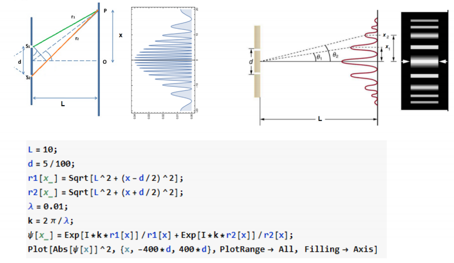

   a. Znajdź limit pojedynczej szczeliny (d → 0).

   b. Znajdź jakąś konfigurację $L$ i $d$, która da dokładnie trzy prążki. To samo zrób dla pięciu prążków.

   c. Wstaw trzecią szczelinę pomiędzy dwie startowe i zobacz zmianę w stosunku do poprzedniego podpunktu.

   d. Uogólnij przypadek dwóch podłużnych szczelin na przypadek 2 punktowych „szczelin” i zaprezentuj płaszczyznę $xy$ z wyrysowanym $|\psi(x,y)|^2$.

## Lista 7

1. Notacja Diracowska (BRA-KET):
   
   a. Unormuj stan $\alpha |0\rangle + \beta |1\rangle + \gamma |1\rangle$, wiedząc że stany bazowe są ortogonalne.
   
   b. Unormuj stan $\alpha |0\rangle$.
   
   c. Napisz w notacji bra-ketowskiej jak formalnie wygląda równanie na wartość własną, wartość oczekiwaną i niepewność pomiaru obserwabli $\hat{A}$.
   
   d. Mając wzór na wartość oczekiwaną z uwzględnionym unormowaniem rozpisz go na postać z całkami i funkcją $\psi(x)$.
   
   e. Podobnie wyraź iloczyn skalarny stanu $\phi(x)$ z $\psi(x)$, a także całkowite prawdopodobieństwo znalezienia stanu $\psi(x)$ w całej przestrzeni.

2. Mając stany $\frac{1}{\sqrt{2}}|0\rangle + \frac{1}{\sqrt{2}}|1\rangle$ oraz $\frac{1}{\sqrt{2}}|0\rangle - \frac{1}{\sqrt{2}}|1\rangle$, sprawdź ich ortogonalność (czyli policz ręcznie iloczyny skalarne stanów samych ze sobą i każdego z każdym).

3. Dla stanu $\frac{1}{\sqrt{2}}|0\rangle + \frac{1}{\sqrt{2}}|1\rangle$ policz tzw. macierz gęstości, czyli wartość $\rho = |\psi\rangle\langle\psi|$. Stany niech reprezentują następującą postać: `|0⟩ = [1, 0]^T`, `|1⟩ = [0, 1]^T`, zaś $\langle 0| = [1 \ 0]$, $\langle 1| = [0 \ 1]$. Zwróć uwagę, że zapis $|\psi\rangle\langle\psi|$ oznacza, że mnożymy macierz kolumnową z macierzą wierszową i końcowo skończymy z macierzą $2 \times 2$, w przeciwieństwie do skalaru wynikającego z $\langle\psi|\psi\rangle$.

4. Mając stan będący sumą stanów własnych: $|\psi\rangle = \sum_{n=0}^{\infty} a_n |\phi_n\rangle$, oraz wiedząc, że $\langle\phi_m|\phi_n\rangle = \delta_{mn}$, wydobądź przez $\langle\phi_m|\psi\rangle$ wartość amplitudy $a_m$.

5. Mając stan ket $|\psi\rangle = \sum_{n=0}^{\infty} a_n|\phi_n\rangle$, napisz jak będzie wyglądał stan bra $\langle\psi|$.

6. Biorąc postać funkcji z poprzedniego zadania: ile wyniesie wartość $\langle\psi|\psi\rangle$ a ile $\langle\hat{A}\rangle = \frac{\langle\psi|\hat{A}|\psi\rangle}{\langle\psi|\psi\rangle}$?

7. Po założeniu konta na platformie IBM zawierającej Quantum Composer [https://quantum-computing.ibm.com/composer/docs/iqx/guide/the-qubit](https://quantum-computing.ibm.com/composer/docs/iqx/guide/the-qubit) (oraz posiłkując się [https://en.wikipedia.org/wiki/Quantum_logic_gate](https://en.wikipedia.org/wiki/Quantum_logic_gate)) wykonaj serię obliczeń na kwantowym komputerze. Udokumentuj swoje wysiłki wykonując serię screenów z własnej pracy, a nie przekopiowując rzeczy np. z tutorialu:
    - Stwórz jedno q-bitowy stan $|0\rangle$ oraz $|1\rangle$.
    - Zaprezentuj realizację flipu obu stanów oraz pokaż ręcznie jak to się odbywa na poziomie zapisu macierzowego.
    - Stwórz na jednym q-bicie superpozycję stanu $|0\rangle$ oraz $|1\rangle$, czyli $\frac{1}{\sqrt{2}}|0\rangle + \frac{1}{\sqrt{2}}|1\rangle$ oraz $\frac{1}{\sqrt{2}}|0\rangle - \frac{1}{\sqrt{2}}|1\rangle$. Pokaż na poziomie zapisu macierzowego powstanie tych stanów.
    - Jaki będzie rezultat podwójnego zadziałania bramką Hadamarda na stan $|1\rangle$? Odpowiedź wygeneruj ręcznie i wykonaj na komputerze kwantowym.
    - Jaki będzie rezultat zadziałania bramką Hadamarda na stany już będące w superpozycji, czyli $\frac{1}{\sqrt{2}}|0\rangle + \frac{1}{\sqrt{2}}|1\rangle$ oraz $\frac{1}{\sqrt{2}}|0\rangle - \frac{1}{\sqrt{2}}|1\rangle$? Odpowiedź wygeneruj ręcznie i wykonaj na komputerze kwantowym.
    - Ręcznie pokaż, że bramka Hadamarda $H$ jest równoważna kombinacji dwóch kwantowych obrotów (najpierw 180 stopni względem osi $z$, a potem 90 stopni względem osi $y$), czyli $R_y\left(\frac{\pi}{2}\right) R_z(\pi) = iH$.

8.  Stwórz splątany układ dwu q-bitowy (entanglement) mając do dyspozycji na każdym q-bicie $|0\rangle$ oraz $|1\rangle$. Pamiętaj o iloczynie tensorowym i fakcie, że ostateczny stan będzie sumą realizacji $|0\rangle \otimes |0\rangle$, $|0\rangle \otimes |1\rangle$, $|1\rangle \otimes |0\rangle$, oraz $|1\rangle \otimes |1\rangle$. Naturalnie uwzględnij stosowne unormowanie zakładając, że każdy jest tak samo prawdopodobny. Zacznij od realizacji napisanej ręcznie i potem wykonaj realizację na komputerze kwantowym. Jeśli chcesz, to możesz też sprawdzić w działaniu [BernDirac](https://github.com/bernie-wu/BernDirac).

9.  Podziałaj bramką Hadamarda na stan $|1\rangle \otimes |1\rangle$ zarówno w komputerze kwantowym jak i zrealizuj rachunki ręcznie (pamiętaj, że trzeba użyć bramkę Hadamarda z macierzą jedynkową: $H \otimes I_{2x2}$, by dało się to zestawić z otrzymanymi stanami. Nie zapomnij rozłożyć końcowego stanu na możliwe superpozycje. Rzecz powtórz dla stanu $|1\rangle \otimes |1\rangle$, ale tym razem zaaplikuj $I_{2x2} \otimes H$.

10. Na ilu równoległych Wszechświatach toczy się ta partia szachów kwantowych?

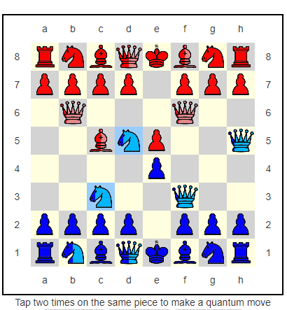

(widoczne wypełnienia to prawdopodobieństwa figur na planszy równe: 1, $\frac{1}{2}$ oraz $\frac{1}{4}$).

Zrzut ekranu pochodzi ze strony: [Quantum Chess](https://github.com/caphindsight/TrulyQuantumChess/wiki) i zawiera pewne modyfikacje (np. piony też wykonują kwantowe ruchy) w stosunku do oryginalnego pomysłu: [Quantum Chess on Steam](https://youtu.be/LikdmXfWO2A).

## Lista 8

1. Zrealizuj animację zderzenia gaussowskiej paczki falowej z barierą potencjału:
   - a. z częściowym odbiciem
   - b. z całkowitym odbiciem (podbijając barierę potencjału)

W obu przypadkach wygeneruj $Re[\psi(x,t)]$ oraz $|\psi(x,t)|^2$.

2. Zrealizuj animację gaussowskiej paczki falowej w nieskończonej studni potencjału.

3. Zrealizuj wykres 3D $|\psi(x,t)|^2$ dla potencjałów: $V(x) = \frac{1}{x^2 + 1}$, $V(t) = \frac{1}{t^2 + 1}$ oraz jakiegoś innego potencjału jednocześnie zależnego od $x$ oraz $t$, który prowadzi do ciekawego wykresu.

4. Wygeneruj animację dla $|\psi(x,t)|^2$ dla własnego potencjału wybranego w zadaniu 3. Uwaga: Animacje mają być wyeksportowane do pliku video w formacie *.avi.

#### Wskazówka
   
Animacje mają być wyeksportowane do pliku video w formacie *.avi:  
   [https://reference.wolfram.com/language/howto/ImportAndExportAnimations.html](https://reference.wolfram.com/language/howto/ImportAndExportAnimations.html)  

Sugeruje się stworzenie: `Table` poszczególnych `Plotów` i dopiero wtedy wykonanie eksportu.  

Poniżej częściowa realizacja Zadania 1 w postaci serii plotów (ale nie animacji) z kodem ze strony: [https://mathematica.stackexchange.com/questions/171776/schr%C3%B6dinger-equation-with-a-potential-step](https://mathematica.stackexchange.com/questions/171776/schr%C3%B6dinger-equation-with-a-potential-step)  

Należy się pobawić parametrami (np. liczbą klatek) i grafiką, by uczynić animację ciekawszą!

   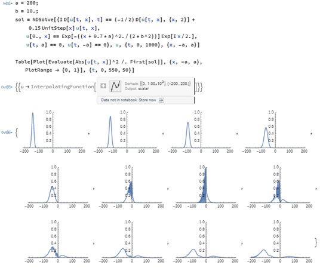

   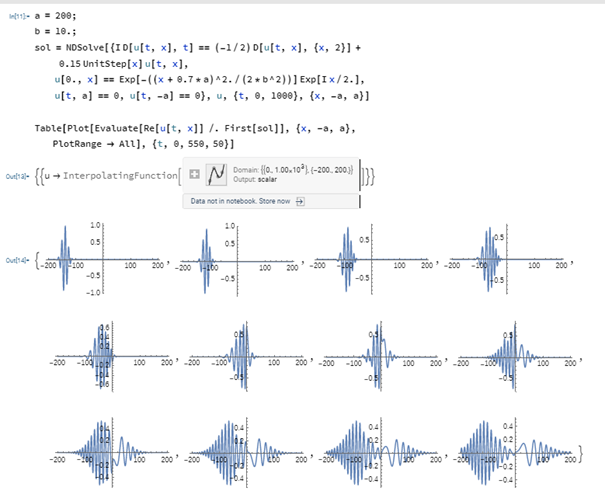

*Zadanie 3* powinno się prezentować  w podobnym stylu co poniżej

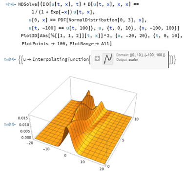

Kod pochodzi z: [https://community.wolfram.com/groups/-/m/t/239088](https://community.wolfram.com/groups/-/m/t/239088) (pamiętaj o `PlotRange -> All`)

## Lista 9

1. Pokaż, że dla dwóch różnych potencjałów wektorowych:
   - $\vec{A} = (-y, x, 0) \cdot \frac{B}{2}$
   - $\vec{A} = (-y, 0, 0) \cdot B$

dostajemy to samo pole magnetyczne $\vec{B} = \nabla \times \vec{A}$.

2. Sprawdź ile wynosi komutator $[x_i, p_j]$ oraz $[p_i, p_j]$ przy przejściu do definicji kanonicznego pędu $p_i = -i\hbar\partial_i - qA_i$.

3. Wybierając drugie cechowanie z pierwszego zadania wstaw je do równania Schrödingera. Uwzględniając rozdzielenie zmiennych względem poszczególnych współrzędnych, wprowadź częstość cyklotronową $\omega = \frac{|q|B}{m}$ oraz zmienną $y_0 = - \frac{p_x}{qB}$ aby finalnie otrzymać:

$$
\left[\frac{\hat{p}_y^2}{2m} + \frac{1}{2} m \omega^2 (y - y_0)^2\right] \chi(y) = \left(E - \frac{p_z^2}{2m}\right) \chi(y)
$$

4. Uzasadnij, że mamy tutaj do czynienia z kwantowym oscylatorem harmonicznym z potencjałem w kierunku $y$. Rozwiąż powyższe równanie w Mathematice.

5. Dla poprzedniego zdania policz jakie mamy stany energii (tzw. stany Landau’a) wykorzystując związki rekurencyjne dla wielomianów Hermite’a.

6. Rachunek zaburzeń dostarcza nam wyrażeń na poprawki energii przy Hamiltonianie interakcji $H_I$ w postaci pierwszej poprawki do energii $E_n^{(1)} = \langle n_0| H_I | n_0 \rangle$ oraz drugiej:

$$
E_n^{(2)} = \sum_{m \neq n} \frac{|\langle m_0 | H_I | n_0 \rangle|^2}{E_n^{(0)} - E_m^{(0)}}
$$

W zewnętrznym polu elektrycznym $F$ – skierowanym przeciwnie do osi $x$, potencjał studni kwantowej zmienia kształt wg $V(x) \to V(x) - q \cdot F \cdot x$. Zbadaj w pierwszym i drugim rzędzie rachunku zaburzeń wpływ słabego pola elektrycznego (czyli $H_I=- q \cdot F \cdot x$) na energię stanu podstawowego dla nieskończonej studni potencjału od $-L/2$ do $L/2$,

$$
|n^0\rangle = \sqrt{\frac{2}{L}} \sin\left(\frac{n\pi}{L}x + \frac{1}{2}n\pi\right).
$$

#### Wskazówka

Wynik powinien wyjść w postaci:

$$
E_1 = 0, \quad \qquad\text{E}_2 = \frac{F^2 L^4 m q^2 (\pi^2-15) }{24 \hbar^2 \pi^4}
$$

## Lista 10

1. Do tworzenia komórek Voronoja/Wignera-Seitza dookoła punktów służy następujący kod:

   ```mathematica
   pts = RandomReal[{-1, 1}, {1000, 2}];
   cells = VoronoiMesh[pts, PlotTheme -> "Lines"];
   points = Graphics[{Red, Point[pts]}];
   Show[cells, points]
   ```
   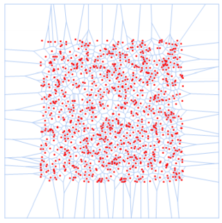

 Wygeneruj podobne wykresy dla następującej liczby losowych punktów: 2, 4, 10, 25, 100.

2. Korzystając z kodu, który generuje dynamiczny rysunek po lewej, dokonaj ręcznej modyfikacji liczby punktów i je ręcznie poustawiaj tak, by odwzorować rysunek po prawej.

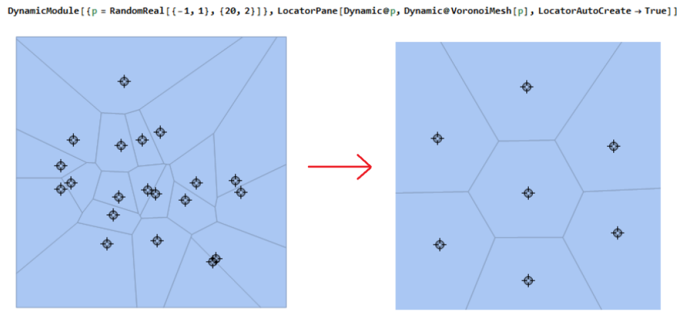

3. Znając relację między wektorami sieci odwrotnej $\vec{b}_i$ przy zadanej 2D sieci pierwotnej $\vec{a}_i$: 

$$
\vec{a}_i \cdot \vec{b}_j = 2\pi\delta_{ij},
$$

ustal $\vec{b}_1$ oraz $\vec{b}_2$ jeśli $\vec{a}_1 = a\left(\frac{\sqrt{3}}{2}, -\frac{1}{2}\right)$ oraz $\vec{a}_2 = a\left(\frac{\sqrt{3}}{2}, \frac{1}{2}\right)$.

4. Ustal wektory sieci odwrotnej dla romboidalnej 3D sieci pierwotnej z wektorami: $\vec{a}_1 = (1, 0, 1)$, $\vec{a}_2 = \left(\frac{1}{\sqrt{2}}, \frac{1}{\sqrt{2}}, 0\right)$, $\vec{a}_3 = \left(\frac{1}{\sqrt{2}}, 1 - \frac{1}{\sqrt{2}}, \sqrt{-1 + \sqrt{2}}\right)$.

5. Skonstruuj i narysuj ręcznie pierwszą strefę Brillouina grafenu, gdzie wektorami sieci są: $\vec{a}_1 = a_0 \left(\frac{\sqrt{3}}{2}, -\frac{1}{2}\right)$, $\vec{a}_2 = a_0 \left(\frac{\sqrt{3}}{2}, \frac{1}{2}\right)$.

6. Wykonaj wykres struktury energetycznej dla grafenu:

   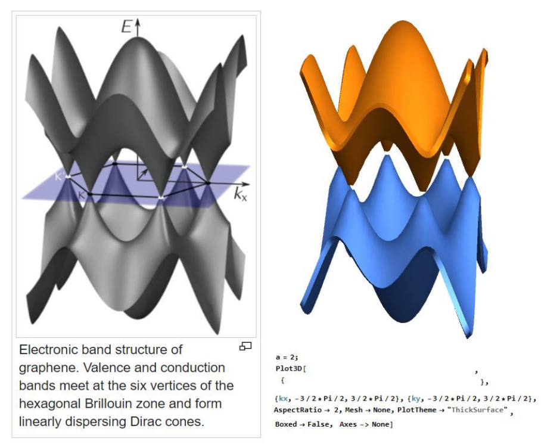

7. Zaczynając od $\epsilon_\mathbf{k}^{\pm}(k_x, k_y) = \pm\gamma\sqrt{3 + 2\sum_{i=1}^{3}\cos(\mathbf{k} \cdot \mathbf{a}_i)}$, gdzie tym razem mamy 2D wektory $\mathbf{a}_1 = a\sqrt{3} \cdot (1, 0)$, $\mathbf{a}_2 = a\sqrt{3} \cdot (1/2, \sqrt{3}/2)$, $\mathbf{a}_3 = \mathbf{a}_2 - \mathbf{a}_1$ zaś $\mathbf{k}$ jest wektorem z pierwszej strefy Brillouina, pokaż, że dyspersja energii jest liniowa w pobliżu punktów Diraca:
   
$$
\mathbf{K}^{\pm} = \frac{4\pi}{3\sqrt{3}a}(\pm 1, 0),
$$

czyli $\epsilon_k^{\pm} \sim |\delta \mathbf{k}|$.

8. Przedyskutuj i uzasadnij, że w tzw. Punktach Diraca elektrony zachowują się jak bezmasowe cząstki.

## Lista 11

1. Rozwiąż na komputerze **radialną część sferycznej 3D kropki kwantowej** ze sferyczną jamą nieskończonego potencjału o promieniu $a$. Zacznij od rozwiązania:

$$
\left[-\frac{\hbar^2}{2m} \frac{1}{r^2} \frac{d}{dr} \left(r^2 \frac{d}{dr}\right) + \frac{\hbar^2 l (l + 1)}{2mr^2} + V(r)\right] R(r) = E \cdot R(r)
$$

Ciągłość w tym przypadku wykazujemy na brzegu potencjału w $r = a$ oraz w $r = 0$.

Dla elektronu (z masą wziętą z tablic) w różnych scenariuszach dla promienia jamy $a = 5$ nm wygeneruj z 5 różnych radialnych funkcji falowych (będących kulistymi funkcjami Bessela) numerowanych parametrem $l = 0, 1, 2, \ldots$. 
   
Uwaga: zszywanie jak również wartości $l$ trzeba raczej zrealizować numerycznie i używać `NDSolve`, `NSolve` (czyli w równaniu powinny się znaleźć bezpośrednie wartości a nie ogólne symbole, ponieważ rozwiązywanie analityczne nie potrafi rozwiązać tak zawiłych formuł). 
   
Pamiętaj, że podobnie do atomu wodoru, czy studni potencjału, trzeba znaleźć energie wymagające przejścia przez szukanie miejsc zerowych, co powoduje też w rozwiązaniu zależność pewnego $n$ numerującego miejsca zerowe.

Przypadek dla $l = 0$ został pokazany na stronie: [https://www.mindnetwork.us/infinite-spherical-well.html](https://www.mindnetwork.us/infinite-spherical-well.html).
